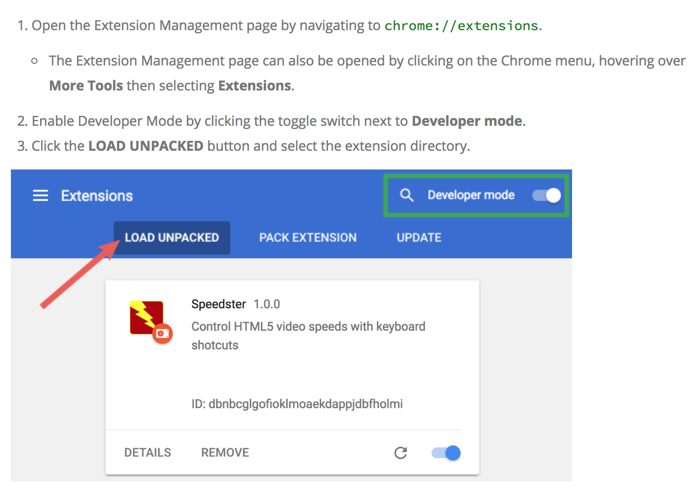

# Speedster
A chrome extension for HTML5 video controls

An extension which adds speed controls to any and all HTML videos on a page. 
```
Speed Controls:

a - to reduce the speed
s - to increase the speed
d - to get speed back to default(1)
```
Adds current speed indicator to `YouTube`, `Netflix` and `Prime Video`


A screenshot from YouTube

## How to install
To install the extension, download and extract the repository files and the follow these instructions: 

